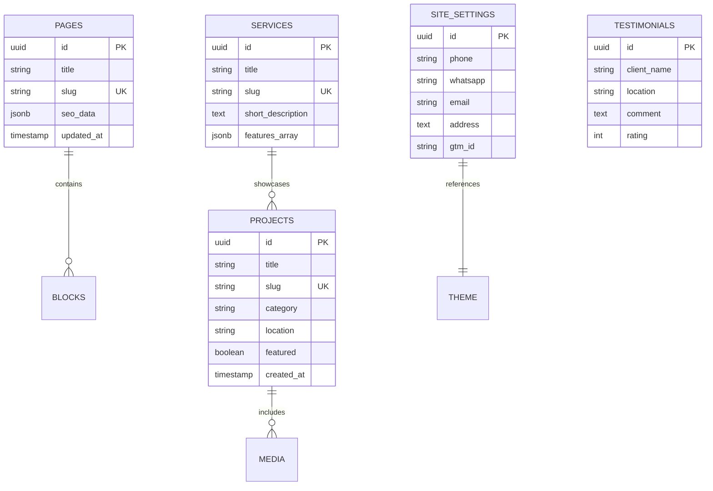

# SYSTEM_SCHEMA_AND_RISK_REPORT.md — Database Schema & Technical Risk Report

## 1. DATABASE SCHEMA (PostgreSQL / Payload ORM)

---

## 2. TECHNICAL RISK MATRIX & MITIGATION

| Identified Risk | Severity | Root Cause | Automated Mitigation Strategy |
|---|---|---|---|
| **Database Corruption / Container Crash** | High | VPS unexpected reboot, disk I/O freeze, OOM spike | Set `restart: unless-stopped` + Docker memory swap limits. DB restarts in <2 seconds automatically. |
| **Spam / DDoS on "Teklif Al" Forms** | Medium | Bot submissions on public quote endpoints | Implement rate-limiting middleware (max 5 form submissions / 15 mins per IP) + Honeypot input field. |
| **Vercel / Cloud Billing / Limit Trap** | High | Hidden tier caps or per-request cloud billing | **100% Avoided:** Self-hosted Docker container on fixed €5/mo Hetzner VPS with zero external API dependencies. |
| **GTM / GA4 ID Null Crash** | Medium | Missing `site-settings` Global entry during initial launch | Wrap `getSiteSettings()` in try/catch. Fall back gracefully without breaking SSR or hydration. |
| **Form KVKK Compliance Violation** | Legal | Missing privacy consent checkbox on contact form | Mandatory KVKK checkbox field in `form-block` schema. Form submit disabled until checked. |

---

## 3. SECURITY & COMPLIANCE CONTROLS

1. **KVKK Compliance:** All forms (`Teklif Al`, `İletişim`) include an un-checked mandatory KVKK Consent Checkbox linked to the static KVKK Aydınlatma Metni page.
2. **Input Sanitization:** Server-side validation using `Zod` schemas for all incoming form payloads before processing.
3. **OWASP Headers:** Next.js configured with `X-Frame-Options: DENY`, `X-Content-Type-Options: nosniff`, `Referrer-Policy: strict-origin-when-cross-origin`, and `Content-Security-Policy`.
4. **Brute-Force Protection:** Payload CMS admin login route `/admin` enforces rate-limiting (max 5 failed attempts locks IP for 15 minutes).
